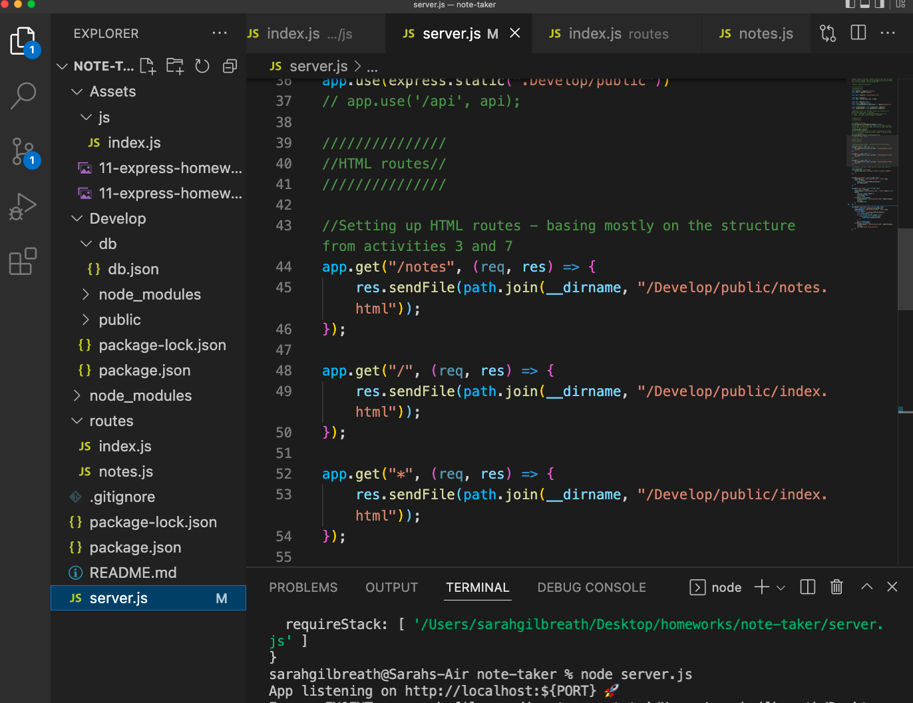
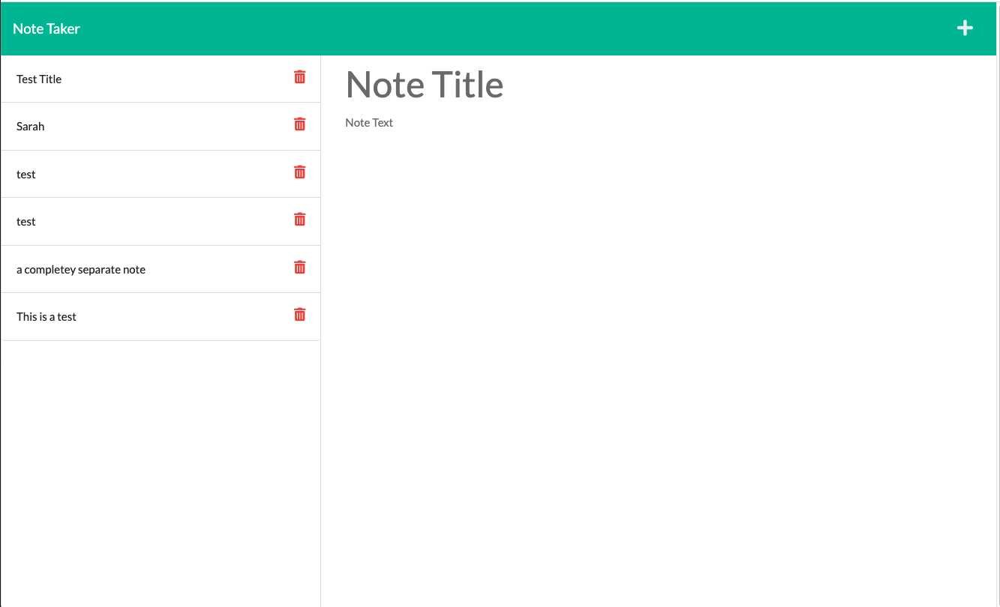

# 11 Express.js: Note Taker

## Description

This is application can write and save notes. The back end is built with Express.js and data is stored and retrieved with JSON. 

## Installation 

Download Express.js and run the program in Node. Open server with Insomnia to view. 

## Usage

Use this app to create notes, similar to the notes app that comes on your phone.

Github repo link: https://github.com/thenoiseinspace/note-taker

Image (also in assets folder): 

PLEASE NOTE: Heroku no longer syncs with GitHub. Our TA told us to submit a recording in lieu of deployment. The walkthrough of my code working is here: https://drive.google.com/file/d/1Fn5cOfM8jj93Zg23DBppdVZYvb6HXc3Q/view?usp=sharing

## Credits

Sources used include: 

Node and Express documentation

Class activities from unit 11   

Special thanks to my dad to working on this with me :)

External tutors (not in bootcamp): Derek and Pablo

Huge thanks to our study group: Lina, Anthony, and mostly Brian Samuels for helping so much!

## License 

General use

